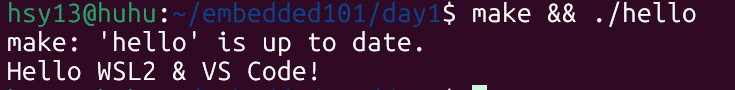

# Day1 入门小结

## 1 运行截图

## 2 今日知识卡片
1. WSL2 就是“Windows 里的真 Linux”，`gcc` 直接编译 ELF  
2. Makefile 三要素：目标:依赖 + Tab + 命令，少 Tab 必报错  
3. `-Wall -Wextra` 打开所有警告，**0 warning 是底线**  
4. gdb 初体验：`gdb ./hello` → `r` 运行 → `bt` 看调用栈  
5. git 三连：`git add .` + `git commit -m "描述"` + `git push` = 绿格

## 3 文件说明
- hello.c        ：最小程序  
- Makefile      ：自动编译脚本  
- pic/day1_run.png ：运行截图
