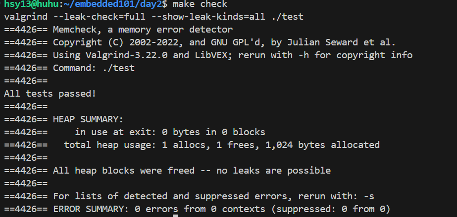

# Day2 手写 my_strlen + assert 单元测试 + valgrind 0 泄漏

## 运行截图

## 今日知识卡片
1. 指针运算：`const char *p = s; p++` 每次移动 1 字节  
2. assert 宏：条件为假立即 abort，定位行号  
3. valgrind 用法：`valgrind --leak-check=full ./可执行文件`  
4. Makefile 技巧：加 `.PHONY: clean check` 防止文件名冲突  
5. 调试指令：`gdb ./test` → `b my_strlen` → `r` → `n` → `p p`