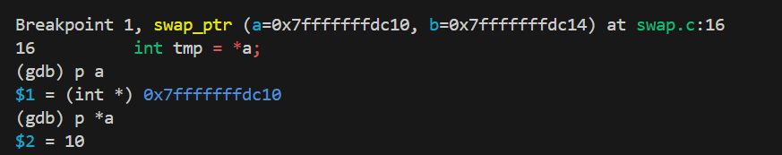

# Day3 值传递 vs 地址传递 + 栈帧图解 + gdb 单步

## 调试截图

## Day3 知识卡片
1. 值传递：函数内修改不影响外部，swap_int 失败  
2. 地址传递：函数内通过指针改外部，swap_ptr 成功  
3. 指针差 `p - s` 表示元素个数，不是字节数  
4. gdb 单步：`b 函数名` → `r` → `n` → `p 指针` → `p *指针`  
5. 栈帧：每次调用函数压栈，局部变量存在栈里
