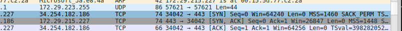

# Day5 手敲 TCP + 极简功能表 + WSL 抓包

## 函数功能表（0 基础背）
| 函数 | 功能 | 面试一句话 |
| --- | --- | --- |
| `socket()` | 新建 TCP 套接字 | 「我用 socket() 新建 TCP 套接字」 |
| `bind()` | 绑定 IP 和端口 | 「我用 bind() 绑定 IP 和端口」 |
| `listen()` | 开始监听连接 | 「我用 listen() 开始监听连接」 |
| `accept()` | 等待客户端连接 | 「我用 accept() 等待客户端连接」 |
| `recv()` | 接收数据 | 「我用 recv() 接收数据」 |
| `send()` | 回发数据 | 「我用 send() 回发数据，实现 Echo」 |
| `close()` | 关闭连接 | 「我用 close() 关闭连接」 |

## 证据截图

